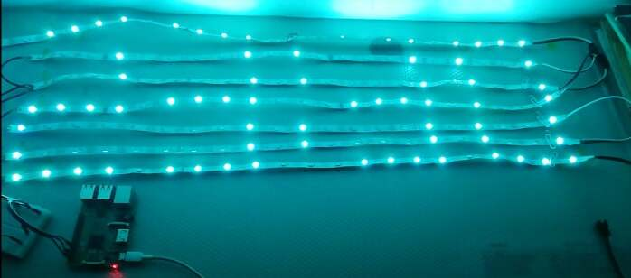

# *It's glow time*

*Стенен дигитален LED часовник, който свети и в предварително зададен час. Добавената функционалност е пускане определена песен от Spotify на телефона на отрябителя.* 

## Как се използва проекта?
От сайта се задава час и spotify песен за аларма. В съответния час устройството ще започне да свети, като лед диодите му ще изписват часа. В същото време от телефона ви ще започне да звучи избраната песен. 

## Използвани технологии

* [Django](https://www.djangoproject.com/) - *framework за backend на сайтове*
* [Raspberry Pi](https://www.raspberrypi.org/) - *Едноплатков мини компютър*
* LED ленти WS2812 *LED ленти, разрешаващи индивидуалното адресиране на диодите*

## Информация за авторите на проекта

* **Йосиф Хамед** - *Software Hardware frontend backend fullstack CEO design* - [JIOjosBG](https://github.com/JIOjosBG/)
